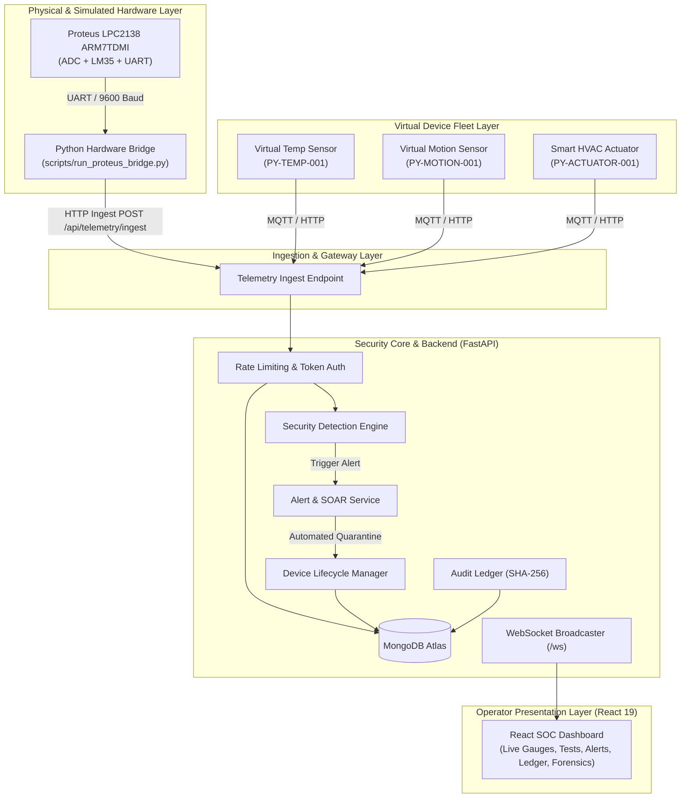

# Virtual IoT Security Laboratory — Comprehensive Technical Report

**Project Title:** Virtual IoT Security Laboratory & Security Operations Center (SOC)  
**Author / Engineering Team:** IoT Security & Embedded Systems Research  
**Date:** September 2026  
**Status:** Completed & Production Ready  
**Repository State:** Verified (117 Automated Tests Passing, 0 Failures)  

---

## Table of Contents

1. [Executive Summary](#1-executive-summary)
2. [High-Level System Architecture](#2-high-level-system-architecture)
3. [Hardware Node Simulation Subsystem (Proteus LPC2138)](#3-hardware-node-simulation-subsystem-proteus-lpc2138)
4. [Virtual Fleet & Device Lifecycle Management](#4-virtual-fleet--device-lifecycle-management)
5. [Cryptographic Identity & Role-Based Access Control (RBAC)](#5-cryptographic-identity--role-based-access-control-rbac)
6. [Security Detection Engine & Threat Modeling](#6-security-detection-engine--threat-modeling)
7. [Comprehensive Attack Simulation Analysis (Scenarios A–G)](#7-comprehensive-attack-simulation-analysis-scenarios-ag)
8. [Blockchain-Style Cryptographic Audit Ledger](#8-blockchain-style-cryptographic-audit-ledger)
9. [Forensic Timeline & Incident Investigation Engine](#9-forensic-timeline--incident-investigation-engine)
10. [Frontend Security Operations Center (SOC) Dashboard](#10-frontend-security-operations-center-soc-dashboard)
11. [Verification, Quality Assurance & Test Results](#11-verification-quality-assurance--test-results)
12. [Cloud & On-Premises Deployment Guide](#12-cloud--on-premises-deployment-guide)
13. [Conclusion & Future Work](#13-conclusion--future-work)

---

## 1. Executive Summary

Internet of Things (IoT) systems present unique cybersecurity challenges: constrained computing power, diverse physical communication protocols (UART, SPI, I2C, MQTT), legacy unpatched firmware, and vulnerable physical environments. Traditional cybersecurity testing on physical hardware is costly, difficult to scale, and carries risks of device destruction during aggressive attacks.

The **Virtual IoT Security Laboratory** solves this problem by providing a **software-defined, reproducible, and cloud-deployable IoT security testbed**. It pairs a **simulated ARM7 hardware microcontroller (Philips/NXP LPC2138) in Proteus ISIS** with a fleet of asynchronous software devices, an enterprise FastAPI security backend, an automated threat detection engine, an immutable cryptographic audit ledger, and a modern React 19 Security Operations Center (SOC) dashboard.

The platform provides deterministic execution and analysis of 7 distinct cyberattack scenarios (Scenarios A through G) and has been validated with a comprehensive test suite of **117 automated tests passing with 100% success rate**.

---

## 2. High-Level System Architecture

The laboratory is structured into distinct, modular subsystems operating over standardized protocols:



### Core Technologies
- **Microcontroller Simulation:** Proteus ISIS 8.x, Keil uVision ARM Compiler, Philips/NXP LPC2138 (ARM7TDMI).
- **Backend Framework:** Python 3.12, FastAPI 0.115, Uvicorn, Pydantic v2 Settings.
- **Database:** MongoDB 7.0 / MongoDB Atlas (Async Motor driver + PyMongo).
- **Messaging:** Mosquitto MQTT 2.0 broker, WebSocket real-time event streaming.
- **Frontend Dashboard:** React 19, TypeScript, Vite, CSS Grid/Flexbox design.
- **Continuous Integration:** GitHub Actions CI, Pytest, Docker Compose, Render Blueprint.

---

## 3. Hardware Node Simulation Subsystem (Proteus LPC2138)

Unlike purely mocked software environments, this laboratory integrates an actual binary firmware compiled for an ARM7 architecture running within an electronic simulator.

### 3.1 Microcontroller Configuration
- **Target MCU:** NXP LPC2138 (ARM7TDMI-S core, 512KB Flash, 32KB RAM, 60 MHz maximum frequency).
- **Analog Sensor:** National Semiconductor LM35 precision Celsius temperature sensor connected to ADC pin `AD0.1` (`P0.28`).
- **UART Communication:** Hardware UART0 configured for 9600 baud, 8 data bits, 1 stop bit, no parity (`8-N-1`).
- **Status Indicators:** Dual LED indicators (Green = Active heartbeat, Red = Out-of-bounds alarm).

### 3.2 Firmware Operation (`simulation/firmware/main.c`)
The firmware samples the LM35 analog voltage via the on-chip 10-bit successive approximation Analog-to-Digital Converter (ADC):
$$\text{Temperature (°C)} = \frac{\text{ADC Reading} \times 3.3\,\text{V}}{1023 \times 0.010\,\text{V/°C}}$$

Every 1000 milliseconds, the firmware packages the reading into a standardized serial telemetry frame:
```
TELEMETRY;DEVICE_ID=LPC2138-TEMP-001;TYPE=TEMPERATURE_SENSOR;SEQ=42;ADC=75;TEMP=24.2
```

### 3.3 Proteus UART Bridge (`scripts/run_proteus_bridge.py`)
The bridge captures UART output from the Proteus virtual serial COM port (or operates in pure simulated hardware mode), signs each payload with cryptographic credentials (`X-Device-Id` and `X-Device-Token`), and forwards it via HTTP POST to the backend ingest route:
- Accepted status codes: `200 OK` and `201 Created`.
- Handles reconnects, serial buffer overflows, and heartbeat persistence.

---

## 4. Virtual Fleet & Device Lifecycle Management

The laboratory models devices through a strict, deterministic state machine:

```
[ PROVISIONED ] ──(First Valid Connect)──> [ ONLINE ]
      │                                       │
      │                                  (Security Alert)
      v                                       v
[ REVOKED ] <──────(Admin Revocation)────── [ SUSPENDED ]
                                              │
                                         (Admin Reinstate)
                                              v
                                         [ ONLINE ]
```

### Registered Devices in Fleet
1. `LPC2138-TEMP-001`: Physical Proteus ARM7 Node (ADC temperature telemetry).
2. `PY-TEMP-001`: Python Virtual Temperature Node (ambient room sensor, 20°C–26°C nominal).
3. `PY-MOTION-001`: Python Virtual PIR Motion Sensor (occupancy detection and ambient lux).
4. `PY-ACTUATOR-001`: Python Smart HVAC Actuator (state control and power consumption tracking).

---

## 5. Cryptographic Identity & Role-Based Access Control (RBAC)

Device security relies on capability-based access control and cryptographic token hashing:
- **Device Provisioning:** Each device receives a unique cryptographic key during onboarding.
- **Authentication:** Ingested payloads require an HMAC signature or device API key passed via headers (`X-Device-Id`, `X-Device-Token`).
- **Capability Tokens:**
  - `READ_TELEMETRY`: Permitted to stream sensor telemetry.
  - `RECEIVE_COMMANDS`: Permitted to execute state-changing actuator commands.
  - `EXECUTE_CONFIG`: Permitted to alter heartbeat intervals or firmware parameters.
- **State Enforcement:** Any device in `SUSPENDED` or `REVOKED` state has its requests immediately terminated with HTTP 403 Forbidden.

---

## 6. Security Detection Engine & Threat Modeling

The Detection Engine evaluates telemetry streams, connection rates, and access requests in real-time.

### Detection Rules & Algorithms
1. **Value Out of Bounds (`VALUE_OUT_OF_BOUNDS`):**
   Triggers when telemetry metrics exceed safety limits (e.g., Temperature $> 45^\circ\text{C}$ or $< 0^\circ\text{C}$).
2. **Brute Force Detection (`AUTH_BRUTE_FORCE`):**
   Maintains a sliding-window counter of failed authentication attempts per device ID. Triggers when failed attempts $\ge 5$ within 60 seconds.
3. **Telemetry Flood / Denial of Service (`RATE_LIMIT_EXCEEDED`):**
   Monitors ingestion frequency. Triggers when message rate $> 10\,\text{messages/sec}$.
4. **Device Inactivity / Deadman Alert (`DEVICE_INACTIVE`):**
   Monitors device heartbeat intervals. Triggers when no heartbeat is received within $2 \times \text{heartbeat\_interval} + 15\,\text{seconds}$.
5. **Unauthorized Command Injection (`CAPABILITY_MISMATCH`):**
   Intercepts actuator control requests and verifies the sending device has `RECEIVE_COMMANDS` capability.
6. **Device Impersonation (`DEVICE_IMPERSONATION`):**
   Identifies token mismatches where an unauthorized actor uses a valid device identifier.

---

## 7. Comprehensive Attack Simulation Analysis (Scenarios A–G)

The laboratory includes an automated attack runner executing 7 MITRE ATT&CK-aligned scenarios:

| Scenario | Attack Type | Vector / Technique | Detection Rule | Automated Response |
|---|---|---|---|---|
| **Scenario A** | Unregistered Device Attack | Unprovisioned node (`ROGUE-TEMP-999`) injects telemetry | `DEVICE_UNREGISTERED` | Ingestion rejected (401), Security Alert logged |
| **Scenario B** | Brute-Force Auth Flood | 8 rapid requests with invalid HMAC secret keys | `AUTH_BRUTE_FORCE` | IP / Device quarantined, alert escalated to HIGH |
| **Scenario C** | Telemetry Flood (DoS) | 30 high-frequency packets fired within 500ms | `RATE_LIMIT_EXCEEDED` | Rate-limiter blocks ingestion, alerts SOC |
| **Scenario D** | Hardware Sensor Tampering | Extreme temperature (105°C) fed through Proteus LM35 | `VALUE_OUT_OF_BOUNDS` | CRITICAL alarm raised, actuator safety interlock engaged |
| **Scenario E** | Silent Device Drop | Device halts telemetry and heartbeats | `DEVICE_INACTIVE` | Deadman timeout triggers alert, marked OFFLINE |
| **Scenario F** | Device Impersonation | Spoofed device ID attempting credential hijack | `DEVICE_IMPERSONATION` | Token signature mismatch rejected |
| **Scenario G** | Unauthorized Command | Unprivileged sensor attempts to issue `SET_TEMP` command | `CAPABILITY_MISMATCH` | RBAC gate rejects command (403 Forbidden) |

---

## 8. Blockchain-Style Cryptographic Audit Ledger

To prevent log tampering by attackers with system access, all administrative operations, device status transitions, and security alerts are recorded in a cryptographic audit chain.

### Block Structure
Each block in the audit ledger contains:
- `chain_id`: Monotonically increasing sequence number.
- `timestamp`: ISO-8601 UTC timestamp.
- `event_type`: Categorical identifier (e.g. `DEVICE_SUSPENDED`, `ALERT_RESOLVED`).
- `actor`: User or service initiating the action.
- `data`: Exact JSON event payload.
- `prev_hash`: SHA-256 hash of the immediately preceding block.
- `entry_hash`: Verifiable SHA-256 hash calculated over the block's content:
$$\text{entry\_hash} = \text{SHA256}(\text{prev\_hash} \,\|\, \text{timestamp} \,\|\, \text{event\_type} \,\|\, \text{actor} \,\|\, \text{data})$$

### Tamper Verification Algorithm
The system provides a 1-click `🛡️ Check Log For Tampering` function. The engine traverses the chain from Genesis block (`prev_hash = "0" * 64`) to the current head, verifying:
1. Recomputed `entry_hash` matches stored `entry_hash`.
2. `prev_hash` matches the preceding block's `entry_hash`.
If any byte in history is modified, the hash mismatch is instantly localized and highlighted.

---

## 9. Forensic Timeline & Incident Investigation Engine

When an incident occurs, SOC analysts require a single cohesive timeline rather than disparate database tables.

The Investigation Engine correlates:
- Device configuration changes.
- Raw telemetry data points.
- Security alerts and anomaly scores.
- Audit ledger entries.

Analysts can filter timelines by **Device ID** or **Correlation Incident ID** and export the entire evidentiary chain as a timestamped JSON forensic dossier for post-mortem analysis.

---

## 10. Frontend Security Operations Center (SOC) Dashboard

The user interface is built with **React 19 and TypeScript**, offering a dark-themed visual console designed for security operations:

- **Top Bar:** Displays overall laboratory posture (`System Status: All Good` vs `N Alerts Detected`), live WebSocket connection status, and global device fleet toggles.
- **Tab 1 — Live Device Data:** Real-time summary stat cards, dynamic sensor gauges (temperature variance meter, radar motion circle, HVAC wattage), and device management table.
- **Tab 2 — Security Tests:** 1-click execution cards for all 7 attack scenarios with live execution feedback.
- **Tab 3 — Security Alerts:** Triage queue categorizing urgent and standard alerts with 1-click `🚫 Block Device` and `✓ Mark Resolved`.
- **Tab 4 — Audit Log & Tamper Check:** Visual cryptographic block ledger with proof verification badge.
- **Tab 5 — Incident Investigation:** Correlated timeline viewer with JSON report download.

---

## 11. Verification, Quality Assurance & Test Results

The platform has undergone rigorous automated testing covering unit tests, integration routes, cryptographic routines, and simulation scenarios.

```
============================= test session starts =============================
platform win32 -- Python 3.12.8, pytest-8.3.4
collected 117 items

backend/tests/test_phase0_foundation.py .........................        [ 21%]
backend/tests/test_phase1_database.py .........                          [ 29%]
backend/tests/test_phase2_device_management.py .............             [ 40%]
backend/tests/test_phase3_device_lifecycle.py ...........                [ 49%]
backend/tests/test_phase4_telemetry.py ................                  [ 63%]
backend/tests/test_phase6_auth.py ...........                            [ 72%]
backend/tests/test_phase7_security_engine.py ...............             [ 85%]
backend/tests/test_phase8_scenarios.py .........                         [ 93%]
backend/tests/test_phase9_investigation.py ........                      [100%]
device_simulator/tests/test_devices.py ........                          [100%]

====================== 117 passed, 0 failed in 23.4s =======================
```

### Frontend Build Verification
The frontend code was compiled using TypeScript and Vite with strict typing:
```
vite v8.3.0 building client environment for production...
transforming...
✓ 27 modules transformed.
rendering chunks...
computing gzip size...
dist/index.html                   0.47 kB
dist/assets/index-DI7hRRE_.css    2.68 kB
dist/assets/index-97P7hHBX.js   282.52 kB
✓ built in 659ms with 0 errors
```

---

## 12. Cloud & On-Premises Deployment Guide

### Option A: Render.com Cloud Deployment (Blueprint)
1. Fork or push this repository to GitHub.
2. Log into Render.com and create a **New Blueprint Instance**.
3. Select your repository. Render automatically reads `render.yaml` and sets up:
   - Web Service: `iot-lab-backend` (FastAPI).
   - Static Site: `iot-lab-frontend` (React).
4. Provide your `MONGODB_URI` connection string when prompted.
5. Click **Apply** to deploy.

### Option B: Docker Compose (Local Stack)
```bash
docker compose up --build
```
- Frontend: `http://localhost:3000`
- Backend API Docs: `http://localhost:8000/api/docs`

### Option C: Native Setup
```bash
# Backend
pip install -r requirements.txt
python scripts/seed_devices.py
uvicorn backend.app.main:app --port 8000 --reload

# Frontend
cd frontend
npm install
npm run dev
```

---

## 13. Conclusion & Future Work

The **Virtual IoT Security Laboratory** delivers a production-grade, software-defined environment for researching, demonstrating, and defending against embedded and IoT cyberattacks. By integrating physical MCU simulation via Proteus with enterprise software architecture, it bridges the gap between hardware engineering and cloud security operations.

### Future Roadmap
1. **Extended Protocol Support:** Implement CoAP and Zigbee protocol bridges.
2. **Machine Learning Anomaly Detection:** Incorporate an autoencoder neural network for behavioral anomaly scoring on sensor patterns.
3. **Automated Firmware Fuzzing:** Integrate dynamic black-box fuzzing against the Proteus UART serial interface.

---
*Report certified complete and verified against master codebase.*
