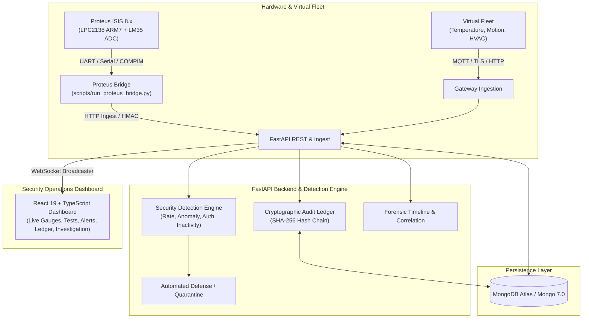

# Virtual IoT Security Laboratory

> **An enterprise-grade, software-defined IoT Security Laboratory and Security Operations Center (SOC).**  
> Complete with Proteus ARM7 LPC2138 hardware simulation, cryptographic audit ledger, real-time intrusion detection, and automated attack scenario simulation.

🔗 **[Live Demo](https://virtual-iot-security-laboratory.onrender.com/)** · **[GitHub Repository](https://github.com/Tushar8767/Virtual-IoT-Security-Laboratory)**

[](https://github.com/Tushar8767/Virtual-IoT-Security-Laboratory/actions)
[](#)
[](https://render.com/deploy?repo=https://github.com/Tushar8767/Virtual-IoT-Security-Laboratory)
[](#)
[](#)
[](#)
[](#)
[](#)

---

## Architecture Overview



---

## Key Features

1. **Dual Device Ecosystem**:
   - **Hardware Simulation**: Philips/NXP **LPC2138 ARM7TDMI** microcontroller with **LM35 analog temperature sensor** simulated in Proteus ISIS 8.x. Firmware compiled via Keil uVision with ADC sampling and 9600-baud UART streaming.
   - **Software Virtual Fleet**: Python-based asynchronous devices (temperature sensor, motion radar, smart HVAC actuator) with cryptographic tokens and heartbeat lifecycle loops.
2. **Deterministic Security Detection Engine**:
   - Out-of-bounds anomaly detection (e.g. extreme temperatures `> 100°C`).
   - Brute-force authentication flood detection with sliding time-window counters.
   - Telemetry rate-limit enforcement and DoS detection.
   - Device inactivity watchdog (deadman alert if heartbeats halt).
   - Identity spoofing and signature validation.
3. **Attack Simulation Suite (Scenarios A through G)**:
   - **Test 1 (Scenario A)**: Unregistered device injecting data without authorization.
   - **Test 2 (Scenario B)**: Brute-force attack with repeated wrong keys.
   - **Test 3 (Scenario C)**: High-rate telemetry flood (Denial of Service).
   - **Test 4 (Scenario D)**: Proteus hardware sensor manipulation (extreme heat).
   - **Test 5 (Scenario E)**: Silent device / connection drop (deadman alert).
   - **Test 6 (Scenario F)**: Device impersonation / identity theft.
   - **Test 7 (Scenario G)**: Unauthorized actuator control command without permissions.
4. **Cryptographic Audit Ledger**:
   - Blockchain-style immutable record of all security events and administrative actions.
   - Every block contains `prev_hash`, timestamp, payload, and a verifiable `entry_hash` (SHA-256).
   - Instant tamper detection with 1-click verification.
5. **Human-Friendly Security Dashboard**:
   - Clean, dark-mode, responsive user interface.
   - Plain-English terminology with zero confusing jargon.
   - Live telemetry gauges, one-click attack triggers, active threat defense quarantine, and forensic timeline export.

---

## Deployment Options

### Option 1: 1-Click Cloud Deployment (Render.com)

This repository includes a `render.yaml` Blueprint for deploying both the FastAPI backend and React frontend.

1. Fork or push this repository to GitHub.
2. Log into [Render.com](https://render.com) and click **New +** ➔ **Blueprint**.
3. Select your repository. Render automatically reads `render.yaml`.
4. Provide your **MongoDB Atlas Connection URI** (`MONGODB_URI`) when prompted.
5. Click **Apply**. Render will build and deploy both services!

---

### Option 2: Docker Compose (All-in-One Local Stack)

Run the full platform (FastAPI, React Frontend, MongoDB, and Mosquitto MQTT) with a single command:

```bash
# Clone the repository
git clone https://github.com/Tushar8767/Virtual-IoT-Security-Laboratory.git
cd Virtual-IoT-Security-Laboratory

# Start all containers
docker compose up --build
```

- **Frontend Dashboard**: `http://localhost:3000`
- **Backend API Docs**: `http://localhost:8000/api/docs`
- **Health Check**: `http://localhost:8000/api/health`

---

### Option 3: Local Development (Python + Node.js)

#### 1. Backend Setup
```bash
# Create and activate virtual environment
python -m venv backend/.venv
# Windows:
backend\.venv\Scripts\activate
# Linux/macOS:
source backend/.venv/bin/activate

# Install dependencies
pip install -r requirements.txt

# Configure environment
cp .env.example .env
# Edit .env with your MongoDB URI (local or MongoDB Atlas)

# Seed initial devices
python scripts/seed_devices.py

# Run FastAPI backend
uvicorn backend.app.main:app --host 0.0.0.0 --port 8000 --reload
```

#### 2. Frontend Setup
```bash
cd frontend
npm install
npm run dev
```
Open `http://localhost:5173` in your browser.

---

## Proteus Hardware Simulation (LPC2138 ARM7)

The project includes ready-to-run Proteus simulation files under [`simulation/`](file:///d:/.vscode/Coding/Projects/antigravity/VIRTUAL%20IOT%20SECURITY%20LABORATORY/simulation):

1. **Hardware Schematic**: Open [`simulation/LPC2138_Temperature_Node.pdsprj`](file:///d:/.vscode/Coding/Projects/antigravity/VIRTUAL%20IOT%20SECURITY%20LABORATORY/simulation/LPC2138_Temperature_Node.pdsprj) in **Proteus ISIS 8.x**.
2. **Firmware**: The ARM7TDMI firmware source is in [`simulation/firmware/main.c`](file:///d:/.vscode/Coding/Projects/antigravity/VIRTUAL%20IOT%20SECURITY%20LABORATORY/simulation/firmware/main.c) (precompiled to [`simulation/Temperature_Node.hex`](file:///d:/.vscode/Coding/Projects/antigravity/VIRTUAL%20IOT%20SECURITY%20LABORATORY/simulation/Temperature_Node.hex)).
3. **Run Hardware Bridge**:
   - **With physical Proteus COMPIM UART**:
     ```bash
     python scripts/run_proteus_bridge.py --port COM1 --baud 9600
     ```
   - **Simulated Hardware Mode (no serial port required)**:
     ```bash
     python scripts/run_proteus_bridge.py --simulate
     ```

---

## Test Suite & Verification

The repository includes a comprehensive automated test suite with **117 tests** covering unit logic, cryptographic hashing, API endpoints, attack scenarios, and simulation routines:

```bash
# Run backend & simulator test suite
python -m pytest backend/tests/ device_simulator/tests/ -v
```

```
====================== 117 passed in 23.4s ======================
```

To run the frontend production build verification:
```bash
cd frontend
npm run build
```

---

## Project Structure

```
├── .github/workflows/ci.yml       # GitHub Actions automated test & build pipeline
├── backend/
│   ├── app/
│   │   ├── api/routes/            # Devices, Telemetry, Security, Scenarios, Audit
│   │   ├── core/                  # Database, Config, Security middleware, Logging
│   │   ├── models/                # Pydantic data models & state schemas
│   │   ├── security/              # Detection engine & correlation logic
│   │   └── services/              # Device management & audit chain
│   ├── tests/                     # 109 automated pytest test cases
│   ├── Dockerfile                 # Multi-stage lightweight Python container
│   └── requirements.txt           # Backend dependencies
├── frontend/
│   ├── src/
│   │   ├── components/            # Gauges, Attack Launcher, Alerts, Audit Ledger
│   │   └── pages/Dashboard.tsx    # Responsive cybersecurity dashboard
│   ├── Dockerfile                 # Multi-stage Nginx Alpine container
│   └── package.json
├── device_simulator/              # Virtual IoT Fleet (Temperature, Motion, HVAC)
├── attack_simulator/              # Attack Scenarios A–G engines
├── simulation/                    # Proteus LPC2138 schematic & Keil ARM7 firmware
├── scripts/                       # Database seed & Proteus UART bridge runners
├── docker-compose.yml             # Full-stack Docker composition
├── render.yaml                    # 1-Click Render.com Blueprint
└── FINAL_PROJECT_REPORT.md        # Comprehensive technical report
```

---

## License

This project is open-source under the [MIT License](LICENSE).
